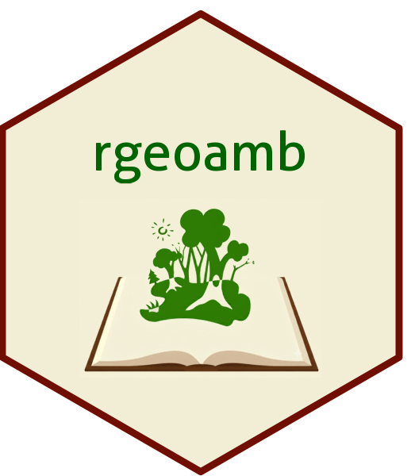

## *rgeoamb*: Bases para análises ambientais em R

*rgeoamb* é um pacote experimental R para análises ambientais, com base no código florestal para delimitação de forma automática de Áreas de Preservação Permanente (APPs). 
Por exemplo, Topo de Morro, Corpos Hídricos, > 45° e também Áreas de Uso Restrito, Cálculo de Área e Perímetro e avaliar o percentual das reservas legais sobre imóveis rurais. 

#### For instalation:
``` R
install.packages('remotes')
library(remotes)
remotes::install_github("marquesfilhojp/rgeoamb")
library(rgeoamb)

```
## Dependências

O pacote R `rgeoamb` atualmente usa as seguintes dependências abaixo e recomendamos, os requisitos necessários para a instalação do pacote R `terra` e do software *System for Automated Geoscientific Analyses*  2.3.2, 5.0.0 - 9.2 em Windows (x64) e Linux, de modo isolado ou em conjunto ao ambiente *QGIS* para o adequado funcionamento. 
* **terra**: A versão do pacote R `terra` usada no presente pacote é **1.9-34**. A base do nosso pacota para operações de manipulação de dados matriciais, desde operações básicas de algebra booleana até estrutura condicionantes, para identificar às áreas de vegetação, de corpos hídricos e as diferentes Áreas de Preservação Permanente. 
* **sf**: A versão do pacote R `sf` usada no presente pacote é **1.1-11**. Este pacote é fundamental somente parra as diversas aplicações com dados vetoriais e integração com pacotes de tratamento para dados tabulares. 
* **spatialEco**: A versão do pacote R  `spatialEco` usada no presente pacote é **2.0-5**. Somente é necessário para efetuar a operação geométrica de dissolução, a nível de dados vetoriais. 
* **Rsagacmd**: A versão do pacote R `Rsagacmd` usada no presente pacote é **0.4.4**. Esta aplicação é necessária para fundamentar identificar às áreas de topo de morros, a partir da função *app_topo_morro*. 


:tools: ## Instalação nos Sistemas Operacionais
Atualmente, o pacote R *rgeoamb* v.0.1.0 foi desenvolvido somente para os sistemas operacionais *Windows* e distribuições *Linux* como Debian, Ubuntu, e especificadamente **version 22.04 LTS Jammy Jellyfish**.


💻 **Windows**

É recomendável usar a versão R 4.5.x e Rtools 45 ou superiores para instalar o pacote `terra`, que é essencial para o funcionamento deste pacote.


 💻 **Linux**

Nas distribuições *Linux* tais como Ubuntu 22.04 LTS (Jammy Jellyfish) e outros sistemas similares, é recommendável a instalação do pacote R `terra` para o adequado funcionamento deste pacote. Recomenda-se seguir as etapas a seguir para a instalação dos pré-requisitos do pacote R `terra`. Para manipulação de dados matriciais e vetoriais, GDAL (>= 2.2.3), GEOS (>= 3.4.0), PROJ (>= 4.9.3), netcdf (>=4.1.3), sqlite3 and tbb.

```bash
sudo add-apt-repository ppa:ubuntugis/ubuntugis-unstable
sudo apt-get update
sudo apt-get install libgdal-dev libgeos-dev libproj-dev libtbb-dev libnetcdf-dev
```


